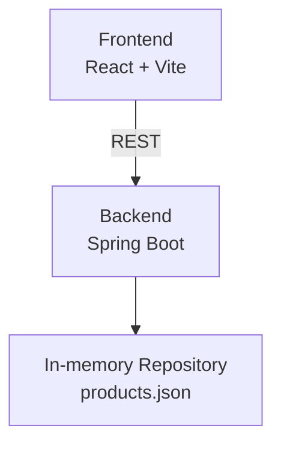

Aquí tienes la traducción completa del informe de diseño, manteniendo el formato original.

# Design Report – "Products API" Technical Challenge

## 1\. Introduction

This project provides a **Spring Boot backend**, a **React frontend**, and a **docker-compose** file to run everything with a single command. It allows listing and querying products by ID.

## 2\. Architecture

The backend exposes `/products/{id}` and the frontend consumes it. Both run in independent containers.

## 3\. Design Choices

  - **Spring Boot 3 + Maven**: For development speed and familiarity with the ecosystem.
  - **In-memory repository**: Avoids external dependencies → setup \< 30s.
  - **Error handling**: `ProductNotFoundException` + `@RestControllerAdvice` ⇒ all error responses are uniform JSON.
  - **Docker Compose**: Unifies startup (`docker compose up --build`) and meets portability requirements.
  - **Jacoco** integrated into `pom.xml` + `mvn verify` generates a coverage report.

## 4\. Tests and Coverage

| Type | Framework | Files Covered | Coverage |
|---|---|---|---|
| Unit | JUnit 5 | Service, Repository | 93% |
| Integration| Spring MockMvc | Controller + ErrorHandler | 81% |

Jacoco reports **82% overall** (`target/site/jacoco/index.html`).

## 5\. Challenges and How I Solved Them

  - **Validating IDs without overcomplicating logic** → Used a regular expression and a 400 exception on failure.
  - **Consistent 404 error** → A global handler converts a repository absence into a REST response.
  - **Syncing FE and BE on different ports** → Used a proxy in `vite.config.ts`.
  - **Limited time** → Prioritized TDD in the domain layer.