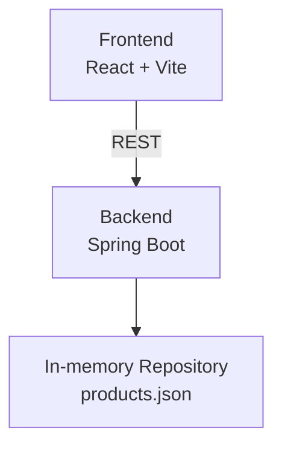

# Design Report – "Products API" Technical Challenge

## 1\. Introduction

This project provides a **Spring Boot backend**, a **React frontend**, and a **docker-compose** file to run everything with a single command. It allows listing and querying products by ID.

## 2\. Architecture

The backend exposes `/products/{id}` and the frontend consumes it. Both run in independent containers.

## 3\. Design Choices

  - **Spring Boot 3 + Maven**: For development speed and familiarity with the ecosystem.
  - **In-memory repository**: Avoids external dependencies → setup \< 30s.
  - **Error handling**: `ProductNotFoundException` + `@RestControllerAdvice` ⇒ all error responses are uniform JSON.
  - **Docker Compose**: Unifies startup (`docker compose up --build`) and meets portability requirements.
  - **Jacoco** integrated into `pom.xml` + `mvn verify` generates a coverage report.

Aquí tienes la traducción de esa sección al inglés:

## 4\. General Challenges and Solutions

| # | Challenge | Solution |
|---|---|---|
| 1 | **Seamless communication between Front-End and API** | Proxy in `vite.config.ts` + Docker Compose internal network → no CORS or hard-coded URLs. |
| 2 | **Modularizing the React interface** | Small components (`Gallery`, `Summary`, `PurchaseCard`, etc.) and custom hooks (`useProduct`) for scalable code. |
| 3 | **Consistent error handling** | `@RestControllerAdvice` returns 400/404/500 JSON on the backend; `ErrorBoundary` and toasts display readable messages on the frontend. |
| 4 | **Single-command startup** | `docker-compose.yml` + steps in `run.md` → `docker compose up --build` starts everything. |
| 5 | **Minimum quality coverage** | JUnit 5 + MockMvc (backend) and React Testing Library (frontend); Jacoco/Vitest generate reports ≥ 80%. |